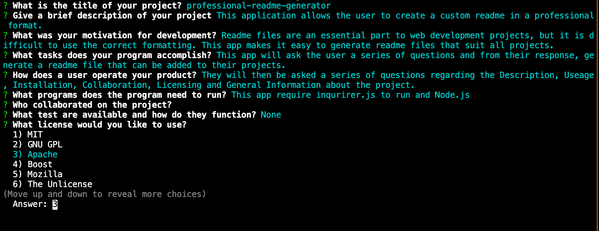
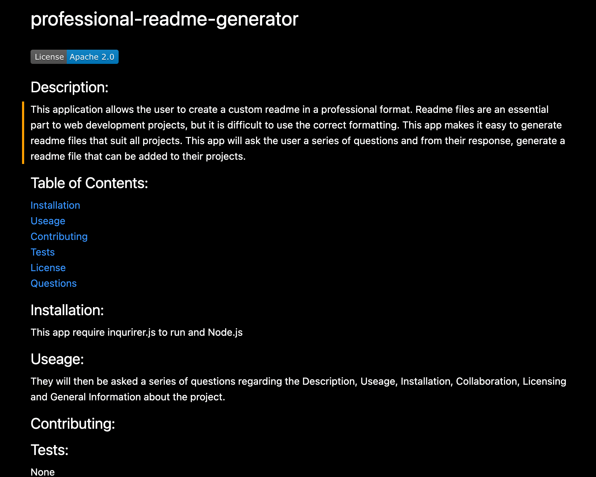

# readme-generator

 # Description
  
 This application allows the user to create a custom readme in a professional format.
 Readme files are an essential part of application deployment, but it can be difficult to create them in the right format. This program makes this process easy and simple.
 Based on the users input, this app will generate a readme file that can be added to the users project.

 # Table of Contents
 
 * [Installation](#installation)
 * [Useage](#useage)
 * [Contributing](#contributing)
 * [License](#license)
 * [Questions](#questions)

 # Installation
 It reuqires node.js and inquirer.js to run.

 # Useage
 The user will be asked a series of questions regarding the projects Description, Useage, Installation, Collaboration, Licensing, Testing and User Info. A readme fil will then be generated based on the input.
 
 
 
 
 

 # Contributing
 Created by Madeleine O'Dea
 

 # License
  Licensed under MIT.
  For more information, visit this link.
  https://opensource.org/licenses/MIT
  
  
# Questions
For more examples of my work, please visit my GitHub at [madsterest](https://github.com/madsterest)
or contact me at odea.madeleine@gmail.com
